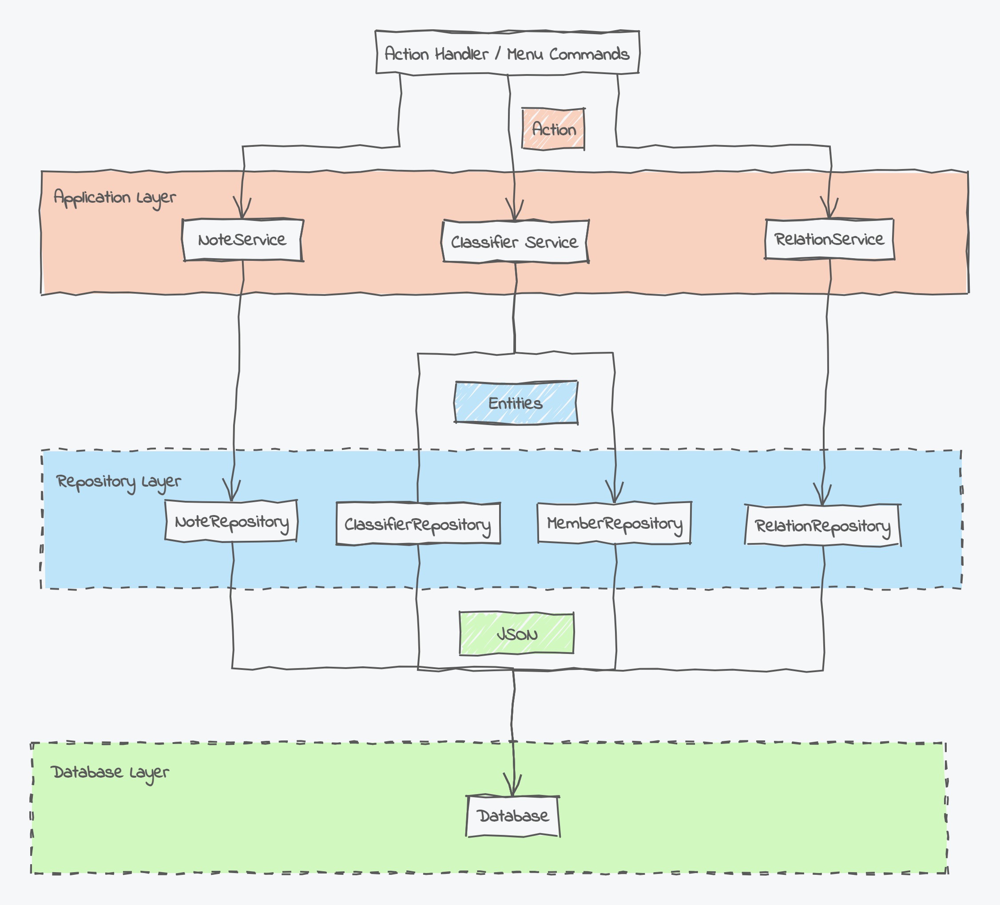

# Moving from Electron to Tauri Part 2 - Local Data Storage

This small sample application is the [second part](https://www.umlboard.com/blog/moving-from-electron-to-tauri-2/) of a blog series investigating how some of [UMLBoard's](https://www.umlboard.com) core concepts can be ported to [Tauri](https://tauri.app/). 
UMLBoard uses a layered architecture with a repository layer to decouple the application logic from the database.



In this project, we're investigating how we could implement such a layered architecture with Tauri and Rust by using two different database backends,  [SurrealDB](https://surrealdb.com/) and [BonsaiDB](https://github.com/khonsulabs/bonsaidb).

The project uses the React+Tauri+Vite template with additional dependencies to the [Redux Toolkit](https://redux-toolkit.js.org/).

## Building the Sample Application

To build and run the app, use the following command

```shell
npm run tdev
```

This will first build the React front end and afterwards build and run the Tauri application.

## Debugging

To debug the application, run the `Tauri Development Debug` task via the VS Code debugger. 

Debugging the front can be done via the `Front-end App Debug` task, but please note that this does currently only work under Windows.

## Recommended IDE Setup

- [VS Code](https://code.visualstudio.com/) + [Tauri](https://marketplace.visualstudio.com/items?itemName=tauri-apps.tauri-vscode) + [rust-analyzer](https://marketplace.visualstudio.com/items?itemName=rust-lang.rust-analyzer)
